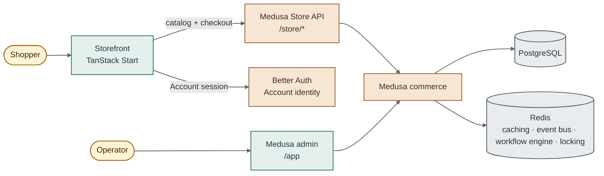

<div align="center">
  <h1>MZE Store</h1>
  <p></p>
  <a href="https://github.com/hadronomy/mze-store/stargazers">
    <picture>
      <source media="(prefers-color-scheme: dark)" srcset="https://shieldcn.dev/github/stars/hadronomy/mze-store.svg?mode=dark">
      
    </picture>
  </a>
  <a href="https://github.com/hadronomy/mze-store/issues">
    <picture>
      <source media="(prefers-color-scheme: dark)" srcset="https://shieldcn.dev/github/issues/hadronomy/mze-store.svg?mode=dark">
      
    </picture>
  </a>
  <p></p>
  <p align="center">
    <strong>An online storefront for a physical shop in the Canary Islands.</strong><br />
    <sub>Medusa commerce, a TanStack Start Storefront, and a local development stack.</sub>
  </p>
  <p></p>
  <a href="#what-mze-store-does">Overview</a> •
  <a href="#development">Development</a> •
  <a href="#interfaces">Interfaces</a> •
  <a href="#local-stack">Local stack</a> •
  <a href="#documentation">Documentation</a>
  <hr />
</div>

## What MZE Store does

MZE Store sells from the Canary Islands into Spain and the wider EU. The
Storefront is the Shopper surface. Medusa owns commerce and the Operator admin.
Better Auth owns Account identity.

The workspace uses TypeScript, TanStack Start, Tailwind CSS, Drizzle, and Vite+.
Shared UI primitives live in `packages/ui`.



The Storefront keeps Account sessions separate from commerce credentials. The
Medusa backend uses Redis for caching, the event bus, the workflow engine, and
locking.

## Development

Use Mise to install the pinned Node and Bun versions:

```sh
mise install
```

Install the locked workspace dependencies:

```sh
bun install --frozen-lockfile
```

Run the interactive setup. It creates only missing environment files after
confirmation, verifies Node, Bun, and Docker, and installs the Vite+ Git hooks:

```sh
bun run mze setup
```

Set a Stripe test secret in `apps/medusa/.env`. Install the pinned Portless
version, then start development:

```sh
bun add --global portless@0.15.5
bun run dev
```

The development command starts or reuses PostgreSQL and Redis, waits for both
services to become healthy, and injects their worktree ports without changing
environment files. It then starts the Storefront and Medusa through Portless.
Start only the Storefront when another worktree owns the shared Medusa route:

```sh
bun run mze dev storefront
```

Inspect the local setup without changing it:

```sh
bun run mze doctor
```

Portless gives the Storefront and Medusa stable local HTTPS URLs. Read the
[Portless integration note](docs/research/portless-integration.md) for the URL
and origin rules.

Run the workspace checks before you submit a change:

```sh
bun run check
bun run test
```

`bun run check` includes formatting, linting, package builds, and type checks.
`bun run test` needs PostgreSQL and Redis.

Run the placeholder browser suite:

```sh
bun run mze test e2e
```

The placeholder has no page or accessibility flow. It does not start a server or
need a browser binary. Set `PLAYWRIGHT_START_SERVER=1` when you add a real flow
that needs the local Storefront, or set `PLAYWRIGHT_BASE_URL` for an existing
server.

The database commands are:

```sh
bun run mze db push --accept-data-loss
bun run mze db generate
bun run mze db migrate
bun run mze db studio
```

The Docker commands are:

```sh
bun run mze docker build
bun run mze docker up
bun run mze services ports
bun run mze docker logs
bun run mze docker down
```

Discover application ports with:

```sh
docker compose port medusa 9000
docker compose port storefront 3001
```

Use `bun run build` to build all applications. Use `bun run mze lint` to run
Oxlint. Use `bun run mze format` to run Oxfmt. Run `bun run mze --help` for the
complete command tree. Add `--json` for versioned NDJSON output.

Knip remains a report because its baseline is not empty. Vite+ caches the
deterministic package builds and package type checks used by the normal
commands.

```sh
bunx knip --no-exit-code --reporter compact
vp run --filter './packages/*' build
bun run check
```

Vite+ tracks package source and build output. It excludes TypeScript incremental
state from the task fingerprint. Development servers, database commands,
migrations, seeds, tests, and application builds stay uncached.
Read the [Knip baseline](docs/research/knip-baseline.md) before you change the
report configuration.

## Interfaces

The Medusa Store API is the only API surface. The Storefront calls Medusa under
`/store/*`.

- Portless: `https://storefront.mze-store.localhost` — Storefront for Shoppers.
- Portless: `https://medusa.mze-store.localhost/store/*` — Medusa Store API.
- Portless: `https://medusa.mze-store.localhost/app` — Medusa admin for Operators.
- Compose: use `docker compose port storefront 3001` and
  `docker compose port medusa 9000` to find the HTTP URLs.

## Local stack

[`docker-compose.yml`](docker-compose.yml) defines the local development stack.
It includes the Storefront, Medusa, PostgreSQL, Redis, and the Medusa migration
job. It is not the production deployment target.

Before you start the full stack, set `STRIPE_API_KEY` in the shell or the
repository `.env` file.

Start the complete stack with:

```sh
bun run mze docker up
```

Compose assigns project-scoped containers, volumes, and random loopback host
ports from the worktree directory. Run `bun run mze services ports` and the
application port commands above to find the active ports.

View the stack:

```sh
bun run mze docker logs
```

Stop the stack:

```sh
bun run mze docker down
```

Production does not use this Compose file. [ADR-0006](docs/adr/0006-redis-from-the-first-deploy.md)
requires a small managed Redis instance. This repository does not define the
application hosting plan.

## Documentation

- [Architecture](docs/architecture.md)
- [Medusa backend guide](apps/medusa/README.md)
- [Architecture decisions](docs/adr/)
- [Roadmap](docs/roadmap.md)
- [Issue tracker guide](docs/agents/issue-tracker.md)
